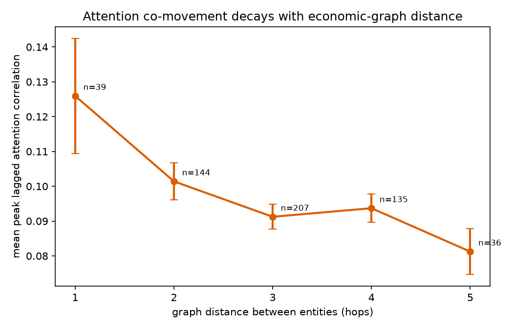
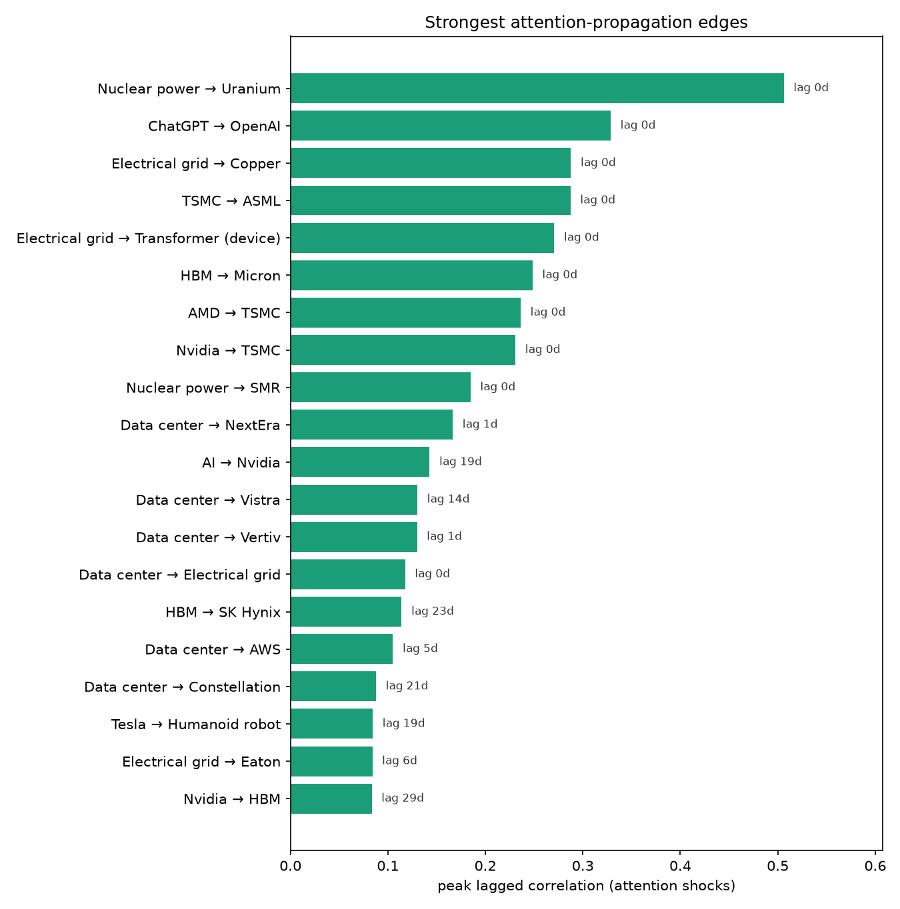
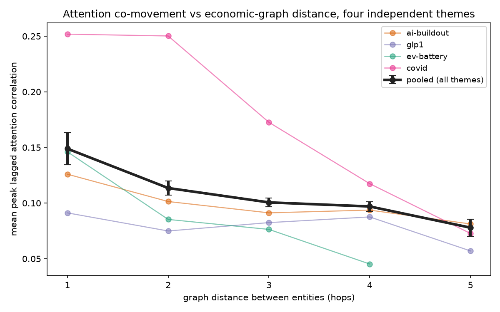
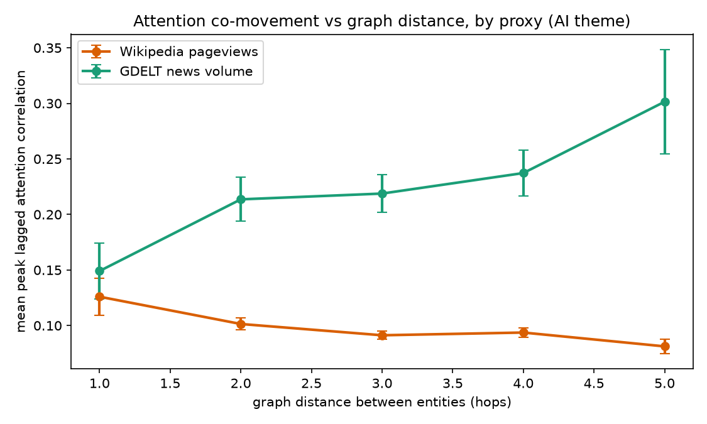
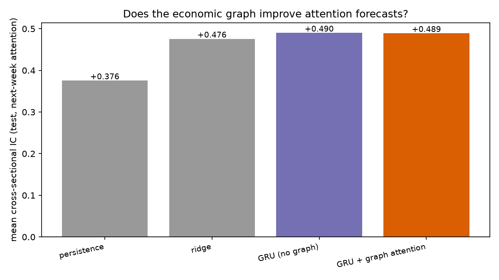

# attention-flow

**Where does market attention go next?**

Most financial ML tries to predict prices. This project tries to learn something different: **how human attention propagates through the economy's graph** — from a viral AI product, to the GPUs it runs on, to the fabs that make them, to the data centers that house them, to the power plants that feed them, to the copper in the wires — and how that propagation eventually becomes capital flow.

```
ChatGPT ──► Nvidia ──► TSMC ──► ASML
              │
              ▼
         Data centers ──► Power (nuclear / gas) ──► Grid ──► Copper
```

The hypothesis: attention is not instantaneous. It cascades along real economic links with lags of **days to weeks**, and those lags are measurable — and eventually, forecastable.

## Phase 0 — falsify it first (this repo, today)

Before building any neural network, Phase 0 asks the question the whole project depends on:

> Does attention actually propagate along economic edges, with lags long enough to model?

**Setup.** 34 entities in the 2022–2026 AI-buildout chain (models → chips → fabs → memory → data centers → power → grid → commodities), 39 directed supply-chain edges, and 4 years of daily Wikipedia pageviews (a free, entity-resolved attention proxy — the same family of measure as Da, Engelberg & Gao's *In Search of Attention*, 2011).

**Method.** Raw pageviews are turned into *idiosyncratic attention shocks*: log views minus a trailing 28-day median baseline, then day-of-week demeaned, then the daily cross-sectional mean (the market-wide news-cycle factor) is removed. Without those two corrections, *every* pair of articles correlates ~0.35 and the graph tells you nothing — the first real lesson of the project. For each pair we compute the peak lagged cross-correlation over lags 0–30 days.

**Result.** Attention co-movement **decays monotonically with graph distance** — the dose-response you'd demand before believing propagation is real:

| graph distance (hops) | pairs | mean peak correlation |
|---|---|---|
| 1 (direct edge) | 39 | **0.126** |
| 2 | 144 | 0.101 |
| 3 | 207 | 0.091 |
| 4 | 135 | 0.094 |
| 5 | 36 | 0.081 |

*(adjacent vs distance≥3: one-sided Mann-Whitney p ≈ 0.08 — suggestive at n=39 edges, not yet decisive; growing the graph is Phase 1's job)*



The lag structure is where it gets interesting. The *strongest* edges peak at lag 0 — that's just co-coverage (ChatGPT and OpenAI appear in the same articles). But the economically meaningful hops show real, multi-day propagation:

| edge | peak lag |
|---|---|
| Generative AI → Nvidia | 19 days |
| Data center → Vistra | 14 days |
| Data center → Constellation Energy | 21 days |
| HBM → SK hynix | 23 days |
| Nvidia → HBM | 29 days |



Median peak lag across all edges: **7 days**. 69% of edges peak at a lag of ≥1 day. That is the window a model — or a person — could act in.

## Phase 1 — the same test, four independent narratives

One theme could be an AI-era artifact. So Phase 1 reran the identical test on three more graphs from unrelated narratives — the **GLP-1 drug chain** (semaglutide → Novo/Lilly → food & dialysis victims), the **EV/battery chain** (Tesla/BYD → cells → lithium/cobalt/nickel), and the **COVID chain** (2020–2022 data: pandemic → vaccines/lockdown → travel victims) — and upgraded the statistics to what a referee would demand: a **degree-preserving graph-permutation null** (rewire the real graph 1,000 times, preserving every node's degree) instead of random pair sampling.

| theme | nodes | edges | decay stat (1hop − ≥3hop) | permutation p |
|---|---|---|---|---|
| AI buildout | 34 | 39 | 0.035 | **0.003** |
| COVID (2020–22) | 18 | 17 | 0.115 | **0.001** |
| EV / battery | 16 | 17 | 0.072 | 0.131 |
| GLP-1 | 15 | 14 | 0.008 | 0.499 |

Pooled across all 939 pairs from the four graphs, the decay is unambiguous:

| distance (hops) | 1 | 2 | 3 | 4 | 5 |
|---|---|---|---|---|---|
| mean peak corr (n) | **0.149** (87) | 0.114 (280) | 0.101 (327) | 0.097 (192) | 0.078 (53) |

- Pooled 1-hop vs ≥3-hop: Mann-Whitney **p = 0.0008**
- Fisher-combined graph-permutation p across themes: **p = 0.00015**



**The verdict on Phase 0's p ≈ 0.08: the gradient is real.** Two independent narratives from two different eras each clear p ≤ 0.003 on the permutation null, and the pooled curve decays monotonically across all five distances.

**And one honest negative.** The direction test — restricted to the 57 edges with peak lag ≥ 1 day, where forward and reverse correlations actually differ — came out flat: 28/57 forward, binomial p = 0.60. At this resolution attention *co-moves along economic edges* but does not detectably favor our hypothesized upstream→downstream orientation. Cross-correlation may simply be too blunt for direction (it isn't causal); Phase 2's tools (transfer entropy, event-based identification) inherit this as their first open question. GLP-1's flat decay is the other miss worth reporting: a 15-node graph over a narrative that is mostly *one* entity's rise may not have enough independent nodes for the test to bite.

## Phase 1b — direction, and a replication that failed in an interesting way

Two follow-ups to Phase 1's open questions, with verdicts that reshape the project:

**A. Direction is absent — now a two-method finding.** Cross-correlation's flat direction test could be blamed on the tool (it's nearly symmetric by construction). Transfer entropy can't be: it asks whether the upstream entity's past reduces uncertainty about the downstream entity's future beyond its own history. Result, across all 87 edges: net-TE positive on 47/87 daily (sign p = 0.26) and 35/87 weekly (p = 0.97). Attention **co-moves along economic edges but does not detectably flow downstream** at daily-to-weekly resolution. Phase 2's model should therefore treat attention as *diffusing* on the graph, not as a directed cascade — a design decision made by the data.

**B. The decay does not replicate in news volume — it reverses.** Rerunning the AI-theme distance test with GDELT global news volume (the share of world news coverage matching each entity, a proxy produced by journalists rather than readers):



News-volume co-movement *rises* with graph distance (0.15 at 1 hop → 0.30 at 5 hops; decay stat −0.084, permutation p = 0.32). Two candidate explanations, which this design can't separate:

1. **Measurement.** Distant node pairs are disproportionately generic terms (copper, uranium, natural gas, power grid) whose keyword news volume tracks the world-news cycle — wars, tariffs, energy crises — not entity-specific attention. Entity-level extraction (GDELT GKG) rather than keyword volume is the obvious upgrade.
2. **Substantive.** Journalist coverage may genuinely organize by macro narrative while *reader curiosity* follows micro economic links. If real, the distance-decay result is a property of **demand-side attention** — what people look up, not what media publishes — which is arguably the side closer to investor behavior anyway.

Either way: the Phase 1 result stands for Wikipedia pageviews and is now precisely scoped rather than overclaimed.

## Phase 2 — the deep-learning test: is attention forecastable, and does the graph help?

Phase 2 trains **AttentionDiffusionNet** — a GRU temporal encoder feeding undirected graph-attention layers (undirected because Phase 1b said so) — to predict every entity's *next-week* attention shock, jointly over all four theme graphs. Strict walk-forward splits (train 70% / val 10% / test 20% by date). The experiment is the ablation: the identical architecture with the adjacency replaced by the identity matrix, so the graph's contribution is isolated exactly.

| model | test MSE | mean window IC |
|---|---|---|
| zero | 0.442 | — |
| persistence (last week = next week) | 0.525 | +0.376 |
| ridge on own lags | 0.325 | +0.476 |
| GRU, no graph | 0.324 | **+0.490** |
| GRU + graph attention | 0.328 | +0.489 |



**Finding 1 — attention is strongly forecastable.** Out-of-sample cross-sectional IC ≈ **0.49** at a 7-day horizon. For calibration: equity return forecasters celebrate ICs of 0.02–0.05. Attention has heavy autocorrelation structure that prices don't, which is exactly why "predict attention, not returns" is a tractable objective.

**Finding 2 — the graph contributes nothing at this horizon.** Graph vs no-graph: 86/186 window wins (sign p = 0.86). Even *burst-conditioned* — evaluating only windows where some entity just had a >2.5σ shock, i.e. when there is something to propagate — the tie holds (0.503 vs 0.506, n = 129). A node's own history already contains everything its neighbors add, seven days out.

This is the project's third propagation negative, and the picture is now coherent: economically adjacent entities share attention (Phase 1, decisively), but the sharing is **contemporaneous, undirected, and fully absorbed within days** — visible in levels, useless for week-ahead increments with a static, hand-drawn graph. The honest conclusion so far: *the graph describes attention's structure; it has not yet been shown to improve attention's forecast.*

What could still rescue graph forecasting, in order of promise: shorter horizons (1–2 days, where Phase 0's lag histogram put most of the mass), learned edges (infer the graph from attention data instead of drawing it from priors), and entity-resolved news events (GDELT GKG) as the shock source. That list is Phase 2b.

## Run it yourself

```bash
python -m venv .venv && .venv/bin/pip install -r requirements.txt
.venv/bin/python scripts/run_phase0.py   # the original falsification test
.venv/bin/python scripts/run_phase1.py   # four themes + permutation null
.venv/bin/python scripts/run_phase1b.py  # transfer-entropy direction + GDELT
.venv/bin/python scripts/run_phase2.py   # train the GNN + ablation + baselines
```

No API keys, ~10 minutes on first run (Wikimedia pageviews are free; responses are cached in `data/raw/`, and this repo ships the cache so reruns are instant). Outputs land in `results/`.

## Honest limitations

- **The decay is a demand-side result.** It holds in Wikipedia pageviews and does NOT replicate in keyword news volume (see Phase 1b). Google Trends and GDELT entity-level (GKG) counts are the remaining replications.
- **Correlation, not causation — and no direction.** The decay survives a degree-preserving permutation null, but both cross-correlation and transfer entropy find no downstream orientation; nothing here identifies *causal* propagation.
- **Hand-drawn edges.** The graphs encode my priors. The eventual system learns its edges from data (supply-chain filings, co-mentions, patents).
- **Attention ≠ alpha.** Whether any of this survives transaction costs against efficient prices is a Phase 3 question, deliberately deferred.

## Roadmap

- [x] **Phase 0 — falsification test**: does attention decay with graph distance? *(yes, weakly — worth continuing)*
- [x] **Phase 1 — scale the evidence**: three more themes across two eras + degree-preserving permutation null. *(Decay confirmed: pooled p = 0.0008, Fisher p = 0.00015. Direction: still unresolved.)*
- [x] **Phase 1b — direction & proxies**: transfer entropy + GDELT news volume. *(Direction: absent, two methods agree. GDELT: decay reverses — the result is demand-side. Both reported in full above.)*
- [x] **Phase 2 — model it**: temporal GNN vs its own no-graph ablation. *(Attention is forecastable: IC ≈ 0.49 out-of-sample. The static graph adds nothing at 7 days — even burst-conditioned. Both reported in full above.)*
- [ ] **Phase 2b — where graph forecasting could still work**: 1–2 day horizons; learned/inferred edges instead of hand-drawn ones; GDELT GKG entity-level events as shocks; contrastive "attention episode" embeddings.
- [ ] **Phase 3 — the capital-flow link**: does *forecasted attention* (IC 0.49 is plenty to work with) lead returns/volume beyond momentum baselines (Cohen & Frazzini's *Economic Links and Predictable Returns* is the benchmark to beat)?

## Why this design

The research bet is a different **learning objective**. Instead of `loss = (predicted_return − return)²` — the most efficiently arbitraged target on earth — the system learns `P(attention shock at node j, t+k | graph, shocks ≤ t)`: how information spreads through the economy before it becomes price. Attention trajectories are noisier but far less crowded, and they come with free, abundant, self-supervised training data: the internet's own logs.

## References

- Da, Engelberg & Gao (2011), *In Search of Attention* — search volume as investor attention.
- Cohen & Frazzini (2008), *Economic Links and Predictable Returns* — attention migrates slowly along customer-supplier links.
- Shiller (2017), *Narrative Economics* — narratives as epidemics.

## License

MIT
